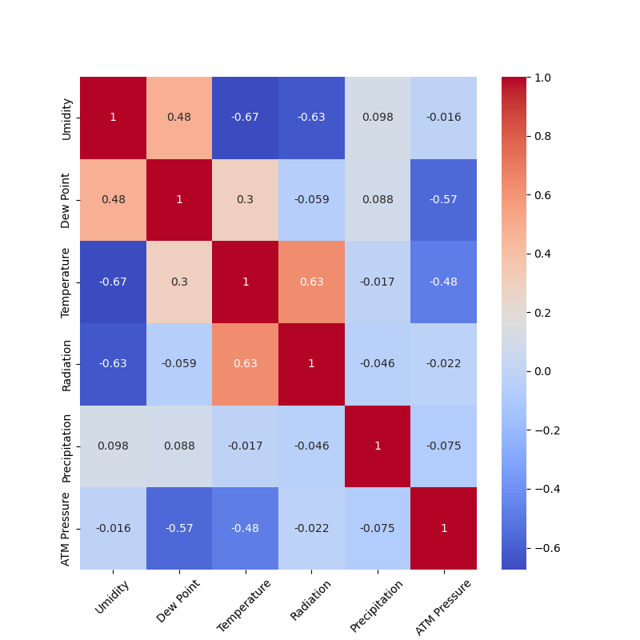

# Weather Analysis for the City José Bonifácio, SP, Brazil

## Introduction
Weather analysis are commonly used to monitor temperatures, precipitation, radiation, winds and many other natural occurencies. This Analysis will present data colected throughout the year 2022 for the city José Bonifácio, São Paulo, Brazil.
All the data were obtained from brazilian National Institute of Metereology's [website](https://mapas.inmet.gov.br/).

## Used Parameters
Inside the folder [Data](Data) there is a file named ['station_data'](Data/station_data.csv), containing the downloaded.
From this Spreadsheet we used the following (with the correspondent column inside the file):
 - Dates (Data)
 - Hour (Hora (UTC))
 - Instant Temperature (Temp. Ins. (°C))
 - Instant Dew Point (Pto Orvalho Ins. (°C))
 - instant Umidity (Umi. Inst (%))
 - Wind Speed (Vel Vento (m/s))
 - Wind Gust (Raj. Vento (m/s))
 - Wind Direction (Dir. Vento (m/s))
 - Instant Pressure (Pressao Ins. (hPa))
 - Radiation (Radiacao (KJ/m²))
 - Precipitation (Chuva (mm))

This station colected that every 1 (one) hour, so there are 24 lines of data for each day for each parameter, marked as 0 for 00:00, 100 for 01:00 and so on.
The data entitled "Instant" are calculated by using the average result between maximun and minumun values of that reading. As an example we have the date 4/1/2022 at 100 hours, the maximun temperature is 25, the minimun 23.8 so the average (Instant Tmeperature) is 24.4.
Note that the values for the "Instant" related data can vary a little.

### Dew Point
Dew is the natural occurying phenomenom of water appearing as dropplets in plants and objects, this can be seen in the morning while it is less hot.
Dew Point is the temperature where the dew occurs.

# The Analysis
To start of the analysis I needed to see the total annual precipitation that the station colected, which resulted in 646.20 mm, with 1.77 mm per day.
Next the Average Monthly Temperature and Precipitation were calculated to form the graph below:

Looking at the graph we can see the most rain occured between January and February and October and December, while the drought season is defined between March and August.
We can also see the variation in temperature, which corresponds to Autumn (21/03-20/06) and Winter (21/06-20/09) seasons, the coldest seasons. The Lowest temperature can be seen in June, while the highest occurs in March.

### Monthly Standard Variation

|  Months   | Precipitation Standard Deviation | Monthly Average Precipitation |
|-----------|----------------------------------|-------------------------------|
|  January  |            1.997628              |            0.336022           |
| February  |            0.947112              |            0.119643           |
|   March   |            0.053367              |            0.012903           |
|   April   |            0.000000              |            0.000000           |
|   May     |            0.067710              |            0.009946           |
|   June    |            0.022236              |            0.002500           |
|   July    |            0.000000              |            0.000000           |
|   August  |            0.088333              |            0.014785           |
| September |            0.026649              |            0.003611           |
|  October  |            0.765893              |            0.101613           |
|  November |            0.375612              |            0.032500           |
|  December |            1.573184              |            0.247849           |

From the table above we have the standard deviation and the average precipitaion of every month.
Using the standard deviation we can, again, clarify the most rainy months as January and December. The deviation above 1 here just means that some days rains more than others. If we look at April and July, the standard deviation and the monthly average precipitation are 0 and can be explained by:
 - The daily rain is 0
 - If it rained, the amount was minimal.

## Correlating Data
To analyze the correlation between variables, a heatmap was created:

This Heatmap compares some variable to see their correlation, the closer the values is to one, the more correlated they are, but, if the coefficient is negative, it means they don't exactly go the same way.
For example, comparing we can see the coefficient for Umidity and Temperature is -0.67, which we can understand as: the higher the temperature, less umidity there is in the air. 
In Dew and Umidity we have a coefficient of 0.48, which is high but less than we could expect (dew is water condensation, right?). Both graphs shown below can explain this:

For the first one, we have the correlation between Umidity and Dew Point, as shown by the trend line (in red) higher umidity equals higher dew point. But, looking at the second graph, correlating Dew Point and Temperature we get that at a certain temperature, the Dew Point starts to diminish, same goes for the umidity. So we have a third variable tempering with umidity and dew point.

## Wind and Atmospheric Pressure
For the second correlation, between wind values and atmospheric pressure, there isn't anything special:

There is a high correlation between Wind Speed and Wind Gust, as gusts require a elevated speed.
It is known that diferences in atmospheric pressure cause changes in wind speeds, so the values shown in the heatmap above can probably be considered high.
That being said, wind speeds and atmospheric pressure did not have great changes troughout the year, this could be a problem with the station (hardware or positioning).

## In Summary...
The data provided by the station is not very reliable, it can define seasons and provide somewhat good temperature readings, but precision is lacking and this can be seen at all variables. Other sources like [ClimaTempo](https://www.climatempo.com.br/) can be a more reliable source of information, as well as [Hidroweb](https://www.snirh.gov.br/hidroweb) for precipitation data.
Problems like that can have a plethora of reasons to occur, from hardware and positioning problems, to software and bad extraction of the data.